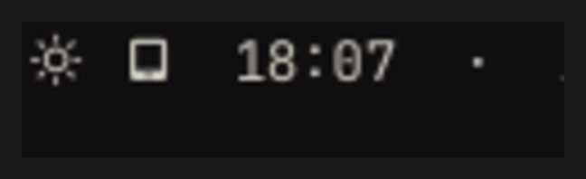

# OmaSideCart

Use an Android tablet as a real second monitor on Hyprland, over the USB cable, with
nothing to click. Plug the cable in and the screen appears. Pull it out and your windows
come home. Plug it back in and they go back.

Built and tested on Omarchy (Arch + Hyprland 0.56.2) with a Galaxy Tab S11 Ultra.

## Why this exists

Plenty of tools can put a Linux desktop on a tablet. All of them need a human to start it:
a bar click, a tap in an app, a QR scan, a browser tab. None of them notice the cable.

OmaSideCart is the missing trigger, plus the plumbing that makes the result a genuine
second desktop rather than a mirror of your laptop screen.

## What you get

- **A real extra output, not a mirror.** Windows live on it and can be dragged across.
- **Its own set of desktops.** The laptop keeps 1 to 5, the tablet gets 6 to 10.
- **Nothing is ever stranded.** Unplug and the tablet's desktops walk back to the laptop
  with their windows and layout intact. Plug back in and they walk back.
- **Nothing on the network.** The stream goes down the USB cable through an `adb` tunnel,
  and the VNC server listens on loopback only. No firewall holes, no Wi-Fi, no USB
  tethering.
- **Touch works.** Touching the tablet moves the Linux cursor.

## Requirements

**On the laptop**

| | |
|---|---|
| Hyprland | 0.56 or newer. It needs `hyprctl output create headless`. |
| Packages | `wayvnc`, `jq`, `adb` (in `android-tools`), `flock` (in `util-linux`) |
| Session | systemd **user** services, and a graphical session |

On Arch, `wayvnc jq android-tools` are all in the official repos.

**On the tablet**

| | |
|---|---|
| Android | any version with USB debugging |
| App | a VNC client. [AVNC](https://github.com/gujjwal00/avnc) is free software and handles the `vnc://` deep link this uses, so the viewer opens by itself. |
| Cable | a data cable. A charge-only cable will not work. |

## Install

There are two halves, and you can take one or both.

- **The service** is the part that does the work. Nothing on the bar is required.
- **The bar widget** is optional. It shows whether the tablet is streaming and toggles it.

### The service


```sh
git clone https://github.com/felipecpaiva/OmaSideCart.git
cd OmaSideCart
./install.sh
```

That copies `bin/sidecar-display` into `~/.local/bin` and the unit into
`~/.config/systemd/user`. It enables nothing and configures nothing.

### The bar widget (optional)

```sh
omarchy plugin add https://github.com/felipecpaiva/OmaSideCart.git --enable
omarchy-restart-shell
```



The icon is **hidden** when no tablet is plugged in, **dim** when one is connected but not
streaming, and **bright** while it streams. Clicking it starts or stops the stream.

It reads `sidecar-display state`, so it needs the service installed above. Remove it with
`omarchy plugin remove io.github.felipecpaiva.omasidecart`.

## Set up, step by step

### 1. Turn on USB debugging on the tablet

Settings → About tablet → Software information → tap **Build number** seven times → back
→ Developer options → **USB debugging** → on.

Plug the cable in. The tablet shows a dialog asking to trust this computer. Accept it and
tick "always allow".

### 2. Find your two values

```sh
adb devices                      # the first column is your serial, e.g. R5XT0AB1CDE
hyprctl monitors | grep Monitor  # your built-in screen, usually eDP-1
```

If `adb devices` is empty, USB debugging is not on yet, or the trust dialog on the tablet
was never accepted.

### 3. Write the config

Copy `config.example` to `~/.config/sidecar-display/config` and fill it in:

```sh
SIDECAR_SERIAL=R5XT0AB1CDE        # required, from `adb devices`
SIDECAR_LAPTOP=eDP-1              # your built-in screen
SIDECAR_MODE=2960x1848@60         # your tablet's native resolution
SIDECAR_SCALE=2                   # 2 suits a high-density tablet, 1 a low-density one
SIDECAR_WS_SET="6 7 8 9 10"       # desktops that belong to the tablet
SIDECAR_LAPTOP_WS_SET="1 2 3 4 5" # desktops pinned to the laptop
```

`adb` has to be reachable. If it is not on `PATH` for systemd user services, give its full
path with `ADB=/usr/bin/adb`.

### 4. Check it before trusting it

```sh
sidecar-display selfcheck
```

Twelve assertions covering the output, the stream, the tunnel, and a full unplug and
replug cycle. Each one has been mutation tested, so a pass means something.

### 5. Turn it on

```sh
systemctl --user enable --now sidecar-display.service
```

### 6. Two settings on the tablet

In AVNC:

- **Settings → Input → Mouse → Hide local pointer: on**
- **Settings → Input → Mouse → Hide remote pointer: on**

`wayvnc` runs with `--render-cursor`, so the real cursor is already painted into the
picture. Left on, AVNC draws its own pointers on top, which sit in a corner until you
touch the screen and then trail your finger around.

If the screen dims after a while, that is the tablet and not this. AVNC's **Keep screen
ON** is already on by default, so it is not a timeout. It is adaptive brightness reacting
to a mostly dark desktop. Turn adaptive brightness off in the tablet's display settings.

## Use

| Key | What it does |
|-----|--------------|
| `SUPER + SHIFT + 7` | send the focused window to tablet desktop 7 |
| `SUPER + 7` | look at tablet desktop 7 |

Think of the tablet's desktops as a box. Whatever you put in the box shows on the tablet.
Unplug and the box comes back to the laptop, still reachable with `SUPER + 6` through
`SUPER + 0`. Plug in and it goes back out.

```sh
sidecar-display status      # plugged, output, stream, tunnel, desktops
sidecar-display selfcheck   # the twelve assertions
sidecar-display up          # do it by hand
sidecar-display down
```

## How it works

1. A systemd user service watches `/sys/bus/usb/devices/*/serial` for your tablet. Matching
   the serial rather than an interface name means any USB port works.
2. On connect it creates a headless Hyprland output, sizes it to the tablet, and splits the
   desktops between the screens with `hl.workspace_rule`. Hyprland owns the rest: it moves
   those desktops off when the output goes and back when it returns.
3. `wayvnc` captures that output on `127.0.0.1`, and `adb reverse` tunnels the port down the
   cable, so the tablet reaches it at `vnc://127.0.0.1:5900`.
4. On disconnect it stops the server, closes the tunnel, and removes the output.

There is no state file. The compositor is the only thing that remembers where a desktop
lives, so there is nothing that can drift out of step with it.

## When something is wrong

| What you see | What it is |
|---|---|
| "Disconnected, server is not running" on the tablet | The adb tunnel dropped, which happens when the adb server restarts. The watcher re-asserts it every two seconds, so give it a moment. `sidecar-display status` shows whether the tunnel is open. |
| `adb devices` empty with the cable in | USB debugging is off, or the trust dialog was never accepted. A charge-only cable does this too. |
| Nothing happens on plug-in | `systemctl --user status sidecar-display.service`. It is a **user** unit and needs the graphical session, so it will not work as a system unit. |
| A second pointer in the corner | AVNC's own pointers. See step 6. |
| The screen dims | Adaptive brightness on the tablet. See step 6. |
| Closing the lid blanks the laptop screen | Omarchy counts a virtual output as an external monitor. Upstream fix pending. Unplug before closing the lid. |
| The bar shows the other screen's desktops | An Omarchy bug, not this. Fixed by any of omarchy PRs [#8435](https://github.com/omacom/omarchy/pull/8435), [#10639](https://github.com/omacom/omarchy/pull/10639), [#7243](https://github.com/omacom/omarchy/pull/7243), [#10190](https://github.com/omacom/omarchy/pull/10190), none merged yet. |

## Things worth knowing

- **VNC has no hardware video encoding.** Text, terminals and documents are comfortable.
  Full screen video is heavier. On an Intel Iris Xe, a whole 2960x1848 screen changing ten
  times a second costs about 23% of one core, and an idle screen costs nothing.
- **Sunshine and Moonlight do not work for this**, which is a shame, because they do have
  hardware encoding. Sunshine finds a Hyprland headless output and selects it correctly,
  then fails to read its pixels (`EGL_BAD_MATCH`), because a virtual output has no GPU
  buffer to hand over. Upstream closed that as not planned
  ([#4197](https://github.com/LizardByte/Sunshine/issues/4197),
  [#2955](https://github.com/LizardByte/Sunshine/issues/2955)). `grim` and `wayvnc` work on
  the same output because they read through shared memory instead.
- **USB tethering is deliberately unused.** Android drops it on every replug, which makes
  anything built on it fail silently.
- **The service does the work, the widget only reports it.** Removing the widget changes
  nothing about how the second screen behaves.

## Uninstall

```sh
./uninstall.sh
```

Stops and disables the service and removes both installed files. It leaves
`~/.config/sidecar-display/config` alone, so delete that yourself if you want it gone.

## Licence

MIT. See [LICENSE](LICENSE).
